# TradeMirror

### Understand your trades. Improve your edge.

**A clearer view of your trading — from executions and costs to the patterns behind your decisions.**

TradeMirror is being built as a trading journal and performance analytics platform for Indian options traders. The goal is to bring trade history, charges-aware P&L, session comparisons, and AI-assisted behavioural reviews into one focused workspace.

> **Current status: V1 release candidate — saved reviews, Zerodha statement costs, journal export and consent-based AI adapter implemented.**
> Account analytics use saved executions; public demos use synthetic data. Migration `202610100004_report_snapshots.sql` is applied. Statement net is shown separately from FIFO execution gross: costs are not allocated to individual slices or days. Live AI requires server-only `OPENAI_API_KEY` and `OPENAI_MODEL`; provider acceptance remains pending. Earlier phase entries below are historical status records.


## Live deployment

- **Website:** [trademirror-ten.vercel.app](https://trademirror-ten.vercel.app)
- **Interactive demo:** [Try without login](https://trademirror-ten.vercel.app/demo)
- **Dashboard:** [Open account dashboard](https://trademirror-ten.vercel.app/dashboard)
- **Vercel project:** `trademirror` in `vkesirariwork-2297s-projects`
- **Git source:** this repository, `main` branch. Future pushes trigger Vercel deployments.
- **Mode:** authenticated workspace. Supabase is connected; signed-out workspace requests redirect to login. Account CSV imports and gross FIFO analytics are active.

First deployment completed on 7 October 2026 from commit `bfec0f9`; landing page and dashboard verified in the browser. Before activating authentication, set the public Supabase variables and `NEXT_PUBLIC_SITE_URL=https://trademirror-ten.vercel.app`, apply the database migration, and configure that origin in Supabase Auth.

## Product flow

### What works today

Configured account flow:

```text
Sign up / log in → Import CSV → Local validation preview → Save executions
                                                        ↓
                         Exact FIFO matching → Gross dashboard + IST daily chart
                                                        ↓
                           Filtered matched journal → Download matching slices
```

The account dashboard reads saved executions and computes gross FIFO metrics. Broker statement costs and realized net have a separate XLSX import flow; execution/day net remains unavailable without a defensible allocation. Private statement upload acceptance is pending. The public `/demo` workspace works with or without Supabase configuration and uses an independent synthetic 48-slice fixture. It includes analytics, journal, computed review and daily/weekly report pages without login. The older unconfigured sample screens follow this separate flow:

```text
Landing page → Explore demo → Dashboard
                              ├─ Search/filter trades → Trade detail → Demo notes
                              ├─ Import preview → Broker card / local CSV selection
                              ├─ Sample behaviour insights
                              ├─ Daily / weekly report previews
                              └─ Settings & report lifecycle explanation
```

With Supabase configured, signup/login use server actions, email confirmation establishes a session, and workspace routes require a validated user. Without configuration, forms show a setup notice and no credentials are sent to a provider. CSV selection and parsing stay local; previews show the selected file’s actual executions.

### Planned end-to-end experience

```text
Sign up / log in
      ↓
Upload Zerodha tradebook → Preview → Validate → Deduplicate → Import
      ↓
Normalize executions → Match trades → Calculate metrics in code
      ↓
Dashboard → Trade details & notes → Behaviour insights → Daily / weekly review
```

A later broker workflow will add:

```text
Connect broker → Sync executed trades → Provisional daily report
                                              ↓
                             Reconcile confirmed final broker data
                                              ↓
                                  Finalized report → Updated review
```

Charges remain estimated while a report is `PROVISIONAL`. A report becomes `FINAL` only when confirmed final broker data is available. Finalization will not depend on a hard-coded time such as 7:30 PM. Exact broker capabilities and data availability must be verified during integration.

## What is built

| Area | Current behaviour |
| --- | --- |
| Landing | Product introduction, workflow, demo and signup entry points |
| Dashboard | Shared scope filters; exact gross P&L, win rate, profit factor, expectancy, averages and closed-slice drawdown; calendar drill-down; five breakdown dimensions; charts and residual lots |
| Journal | Instrument, side, result and exit-date filters; pagination; per-slice detail dialog with source identities; filtered CSV export; calendar-to-day navigation |
| Trade detail | Account journal dialog: exact prices, quantities, timestamps, holding time and source identities. Notes, tags and a three-item plan review editor implemented; production persistence enabled by the applied journal migration; older sample detail pages are demo-only |
| Imports | Zerodha CSV validation/preview, account-owned atomic save, cross-file duplicate protection and import history; broker connection remains a preview |
| Review | Computed observations, date-scoped tagged strategy comparisons and evidence drilldowns; consent-based AI adapter awaits live server setup |
| Reports | Daily/weekly gross reviews, JSON/CSV export, browser print and immutable snapshot storage; save/reload acceptance pending |
| Settings | Profile persistence, recovery and portable journal/plan JSON export; restore unsupported |
| Foundation | Responsive navigation, loading UI, invalid-trade 404, normalized types, broker adapter contract |

In the unconfigured demo, the dashboard period selector changes summary cards between the sample day and week. Charts and breakdowns are explicitly labeled as the sample week. Fixtures cover 1–7 October 2026; they are not live market data.

## Phase-by-phase diagrams

This is the current implementation map as of **10 October 2026**. **Active** means implemented and available; **acceptance pending** means a remaining live check, not a completed V1 release. The progress log below records historical milestones.

### User journey — demo to personal workspace

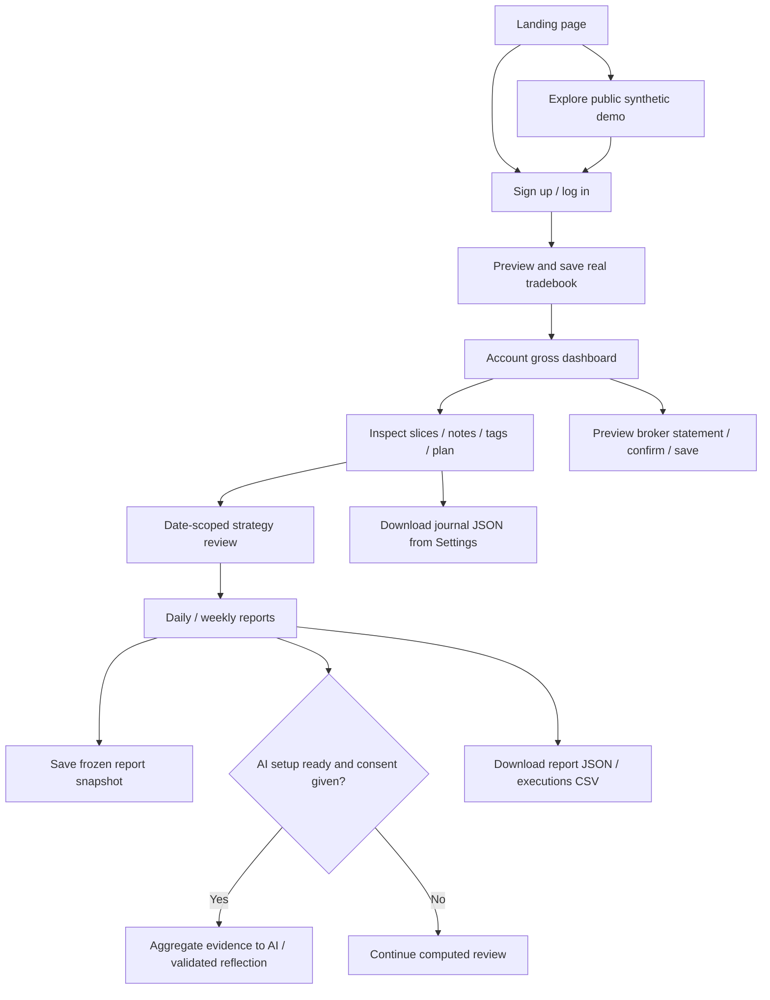

The public demo never reads or writes personal history. AI shares only selected period aggregates after consent. Statement net and execution gross remain separate.

### Phase 1 — frontend foundation · complete

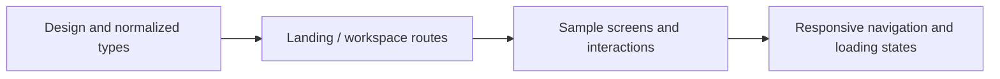

**Delivered:** workspace foundation, then the midnight/violet theme, mobile navigation and scrollable journal. **Next:** retain physical-device acceptance as a release check.

### Phase 2 — authentication and ownership · active

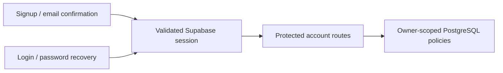

**Delivered:** login, confirmation, recovery, profile settings and owner isolation. The owner confirmed login. **Boundary:** account credentials stay in the authentication flow; public demo records are separate.

### Phase 3 — tradebook import · active

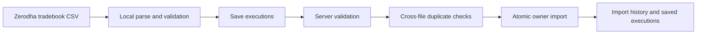

**Delivered:** exact value validation, repeated/overlapping import protection and visible save results/history. **Boundary:** preview alone does not persist data; conflicting source records fail rather than overwrite history.

### Phase 4 — matching and reconciliation · FIFO active

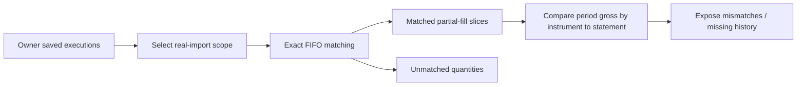

**Delivered:** exact matching, long/short slices, partial fills and residual lots; statement comparison is implemented. **Pending:** broker-certified settlement reconciliation. Slice counts are not whole-position counts.

### Phase 5 — gross metrics and broker costs · implemented, acceptance pending

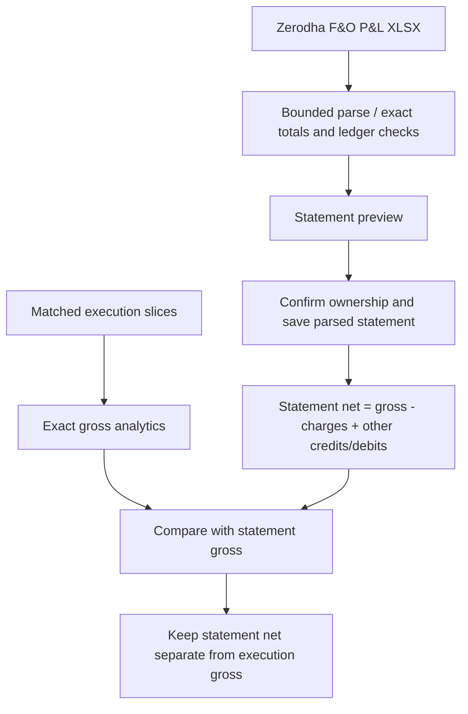

**Delivered:** statement charges, signed adjustments and realized net; independent local source validation. **Pending:** owner statement upload/save/reload acceptance. **Limit:** no day/slice cost allocation or unrealized P&L inference.

### Phase 6 — personal dashboard · active

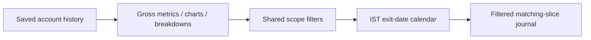

**Delivered:** real-history dashboard, gross ratios, closed-slice drawdown, breakdowns and calendar drilldowns. **Limit:** execution net remains unavailable until a defensible cost allocation exists; the 30-second product target is not measured.

### Phase 7 — journal and strategy review · active

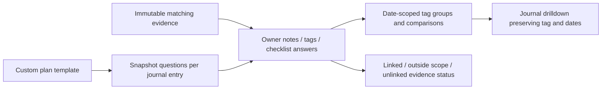

**Delivered:** persistent journal, custom plan, tag filters, comparisons and read-only connection status. **Limit:** changed evidence does not inherit old notes; manual reassignment and multiple templates remain planned.

### Phase 8 — AI reflection · adapter ready, live setup pending

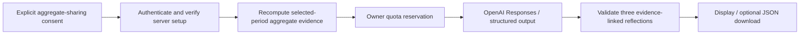

**Delivered:** server adapter, consent, bounded output and quota tests. **Pending:** server `OPENAI_API_KEY` / `OPENAI_MODEL` and live provider acceptance. No raw CSV, symbols, account identity, notes or tags are sent. Output is page-local until downloaded; it is not saved automatically as a snapshot.

### Phase 9 — reports and portable copies · implemented, acceptance pending

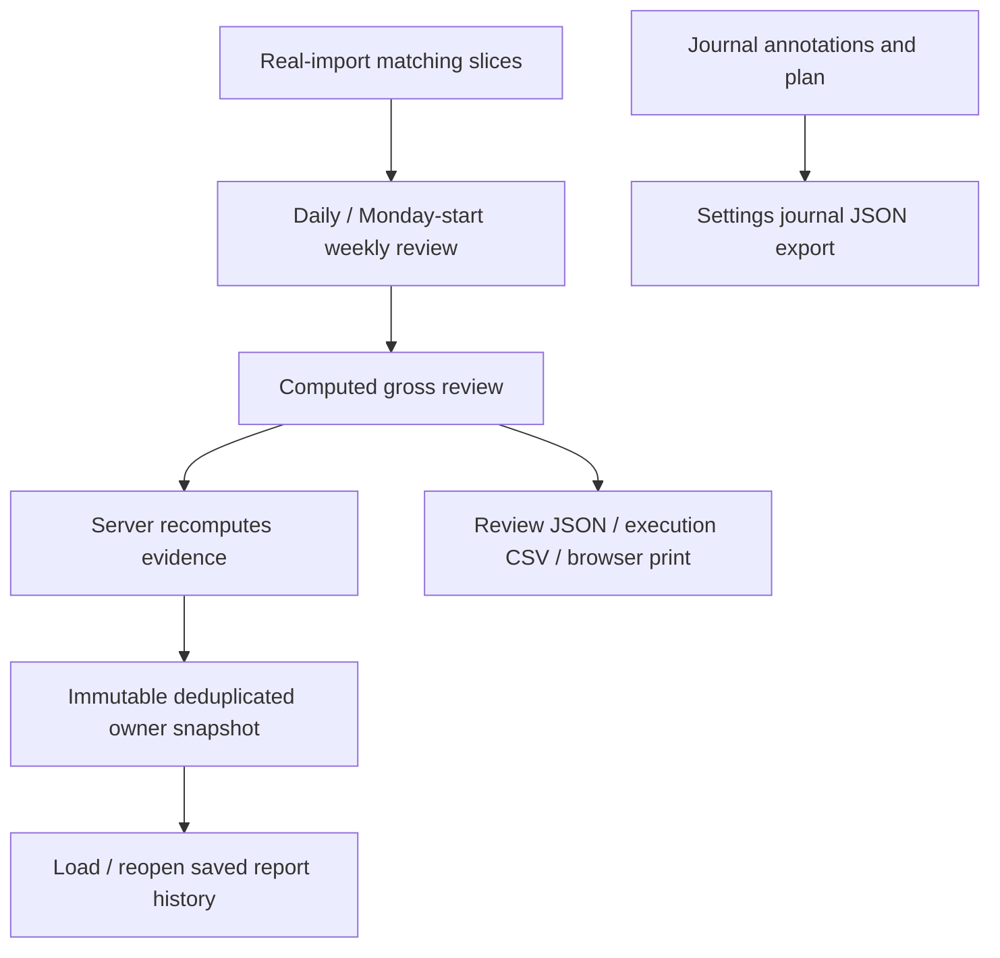

**Delivered:** computed reviews, applied snapshot storage and export controls. **Verified live:** owner history loads; journal export returns prepared status. **Pending:** snapshot save/reload, actual downloaded-file receipt/content and print/PDF acceptance. Journal JSON is not a complete account backup; restore is unsupported.

### Phase 10 — release acceptance and onboarding · in progress

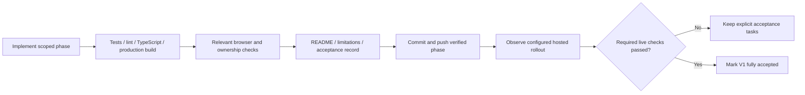

**Latest implementation validation:** 44 tests plus lint, TypeScript and Webpack production build passed. Six-step onboarding and hosted routes are verified. **Open checks:** private statement/snapshot writes, live AI, export receipt/print and remaining physical-mobile acceptance. See [V1 acceptance checklist](docs/V1_RELEASE.md). Documentation-only diagram updates use Markdown/link/diagram checks rather than rerunning the unchanged app build.

### Planned next versions

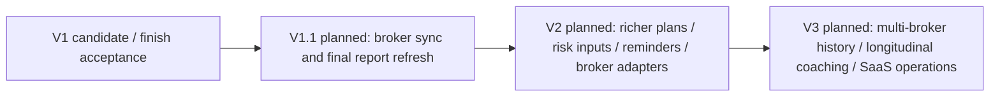

Some originally proposed V2 basics—notes, tags, one custom plan, comparisons and snapshot history—have already shipped in V1. Richer capabilities still need their own inputs and acceptance. Sync, market replay/MFE/MAE, discipline scoring, billing and automated trading are not active; order execution is outside the current roadmap.

### Data relationship map — simplified ER diagram

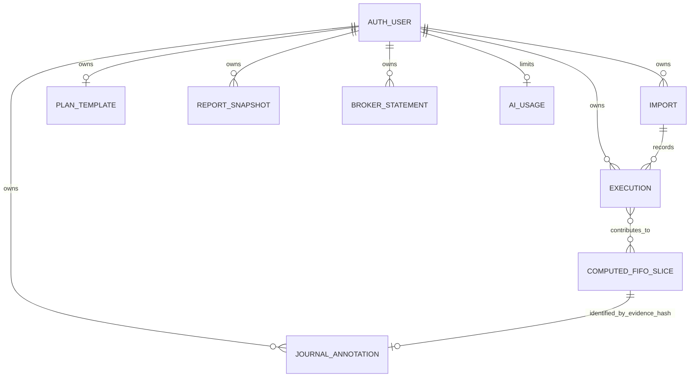

This is a conceptual map, not a literal database schema: FIFO slices are computed from executions, and annotation links use an evidence hash rather than a slice foreign key. Snapshots freeze summary payloads; broker statements store parsed totals and breakdowns. Raw source workbooks are not retained by the statement flow.


## Version roadmap

The roadmap is a proposed sequence, not a release-date commitment. Later versions will be refined after the previous milestone is validated.

### V1 — A reliable trading journal

**Target:** upload a Zerodha CSV and review a trustworthy performance dashboard, with a target of approximately 30 seconds for a typical tradebook. This target is not yet measured.

| Phase | Scope | Status |
| --- | --- | --- |
| 1 | Frontend foundation, design, routes, sample data, normalized types | **Complete** |
| 2 | Supabase authentication, PostgreSQL schema, user isolation and access policies | **Connected; login accepted** |
| 3 | Zerodha CSV parsing, validation, import history, duplicate protection | **Parsing, saving and history active; owner upload verified** |
| 4 | Deterministic trade matching, partial fills, open positions, reconciliation | **FIFO active; statement comparison implemented; certified settlement reconciliation pending** |
| 5 | P&L and cost analytics with explicit estimated / confirmed cost handling | **Gross metrics active; statement costs/net implemented; owner upload acceptance pending** |
| 6 | Connect the dashboard and filters to actual user data | **Gross dashboard and matched journal connected; net analytics pending** |
| 7 | Persistent notes and trade detail metrics supported by available data | **Notes, tags, custom plan and strategy comparisons active** |
| 8 | AI behaviour interpretation from computed, structured metrics | **Consent-based adapter ready; server setup/live acceptance pending** |
| 9 | Daily / weekly review generation and report history | **Computed reviews and snapshot storage implemented; save/reload acceptance pending** |
| 10 | End-to-end validation, security checks, deployment and onboarding | **Onboarding active; V1 acceptance in progress** |

### V1.1 — Zerodha sync & final reports

- Verify supported broker APIs and authorization requirements, then implement the first adapter.
- Import executed trades and reconcile them with existing imports without duplicates.
- Support repeated synchronization, connection expiry, retries, and visible sync status.
- Refresh provisional reports when confirmed final data becomes available.
- Preserve report revisions so users can understand why net P&L changed.

Broker sync follows a reliable normalized import and matching engine. No real broker connection exists yet.

### V2 — A stronger review workflow

Proposed scope:

- Persistent trading plans and journal tags, with comparison against recorded rules.
- Evidence-based discipline scoring with transparent definitions and sufficient input data.
- Longer-term session, instrument, cost, and holding-time comparisons.
- Review history, PDF export, and user-controlled reminders.
- Additional broker adapters after verifying their supported data and integration requirements.

MFE, MAE, early-exit flags, and stop-loss violations will require suitable price or plan data. Missing inputs must remain unavailable rather than inferred from a tradebook alone.

### V3 — A mature performance workspace

Proposed direction, subject to user feedback:

- Unified history and reconciliation across supported brokers.
- Configurable review rules and personal progress tracking over time.
- Longitudinal coaching grounded in verified metrics and journal context.
- Reliable background synchronization, observability, and data-quality tooling.
- Production SaaS operations: billing, account export/deletion, recovery, and scale testing.

The product remains focused on trading reflection and analytics. Live signals, buy/sell recommendations, and automated order execution are outside the current roadmap.

## Development & delivery flow

Each phase follows the same loop:

1. Define the phase scope and acceptance criteria.
2. Implement the smallest complete milestone.
3. Run checks appropriate to the change; validate relevant UI and data behaviour.
4. Update this README with completed work, current limitations, validation results, and the next phase.
5. Commit the verified phase and push it to `main` in this repository.

Phase-by-phase pushes are authorized for this project. Each completion update should include the commit and any remaining blockers. Secrets, credentials, environment files, build outputs, and installed dependencies must not be committed. Publishing/deployment remains a separate action from a Git push.

## Progress log

| Milestone | Date | Result |
| --- | --- | --- |
| Phase 1: frontend foundation | 7 October 2026 | All requested demo routes built; lint, TypeScript, production build, route checks, journal filters, report tabs, and mobile navigation verified. Initial implementation commit: `be1d940`. |
| Documentation & roadmap | 7 October 2026 | Added current/planned product flows, V1–V3 roadmap, delivery workflow, limitations, and project description. |
| Phase 2: auth & database foundation | 7 October 2026 | Supabase integration, protected accounts, migration and access-policy tests implemented; hosted activation pending. |

**Current work:** Phase 2 is connected locally and on Vercel. The hosted migration is applied; all nine tables have RLS. Email/password signup and email confirmation are enabled. Signed-out redirects and anonymous table denial passed. The owner confirmed successful login. Password recovery and editable account settings are available.

**Next implementation step:** Implement the validated Zerodha CSV preview and parsing pipeline (Phase 3), followed by trusted persistence and duplicate protection.

## Run locally

Use **Node.js 20.19 or newer**; Node 24 is recommended and selected by `.nvmrc`.

```sh
# If using nvm:
nvm use

npm install
npm run dev
```

Open [localhost:3000](http://localhost:3000). For an existing lockfile, `npm ci` gives a reproducible install.

```sh
npm run lint
npm run typecheck
npm run build
npm start
```

`npm start` runs the production build; run `npm run build` first. The unconfigured sample demo requires no keys. For real authentication, follow [Supabase setup](supabase/README.md) and configure `.env.local` from `.env.example`. Never commit that file.

## Routes

| Route | Purpose |
| --- | --- |
| `/` | Landing page |
| `/login`, `/signup` | Signup/login with configured Supabase; setup notice otherwise |
| `/auth/confirm` | Confirmation / recovery PKCE callback with fixed app destinations |
| `/forgot-password`, `/reset-password` | Email recovery and authenticated password update |
| `/dashboard` | Performance overview |
| `/trades` | Searchable and filterable journal |
| `/trades/tm-1` | Example trade detail; sample IDs `tm-1` through `tm-8` |
| `/import` | Broker / CSV preview |
| `/insights` | Sample behaviour insights |
| `/reports` | Daily / weekly previews |
| `/settings` | Profile and broker connection preview |

## Stack & architecture

Current stack: Next.js 16.4 App Router, React, TypeScript, Tailwind CSS, Recharts, and Lucide. Implemented integration: Supabase Auth / PostgreSQL (connected). Planned service: an AI interpretation API.

| Location | Responsibility |
| --- | --- |
| `app/(workspace)/` | Shared demo layout and workspace routes |
| `components/` | Reusable UI, charts, journal, reports, and broker cards |
| `types/index.ts` | Normalized trades, orders, users, connections, metrics, insights, and report states |
| `data/mock.ts` | Sample fixtures, separate from components |
| `lib/analytics/` | Formatting today; deterministic matching and analytics in later phases |
| `lib/brokers/adapter.ts` | Future broker adapter contract |

Future implementations belong in `lib/brokers/adapters/`. Normalized trades must remain independent of broker payloads; `rawDataId` provides a reference for separately stored raw records. The initial migration and row-level policies are in `supabase/migrations/`. Setup and hosted acceptance checks are in `supabase/README.md`.

### Core rules

- Calculate metrics in deterministic code; let AI interpret structured results.
- Keep calculation engines outside UI components.
- Isolate data by authenticated user and enforce access at the database layer.
- Keep estimated charges visibly distinct from confirmed charges.
- Finalize reports using confirmed data availability, not a fixed clock time.
- Store unavailable metrics as unavailable; do not fabricate discipline or excursion signals.

## Current limitations

Supabase auth and profile persistence are configured locally and in production. No broker OAuth/API, persisted CSV imports, matching engine, production P&L or charges engine, AI generation, payments, notifications, cron jobs, or background workers.

Auth forms validate on the client and server. With project configuration, credentials go only to the configured Supabase Auth service through server actions. CSV files are parsed in the browser; files and executions are not uploaded or persisted. Trade notes only remain in the mounted page session. Connect buttons explain future availability; AI generation and PDF export are disabled. Without Supabase configuration, workspace routes are public demo pages. With configuration, they require a valid session and display an empty account workspace with editable profile settings; sample trades are never presented as account-owned records. Scores are illustrative rather than computed from rule adherence.

## Validation & dependency status

At Phase 1 completion:

- Lint, TypeScript, and production build passed.
- All main routes returned HTTP 200; unknown trade URLs returned HTTP 404.
- Journal filters, trade detail navigation, report tabs, and mobile navigation were checked in the browser.
- Production dependency audit reported zero vulnerabilities.
- The Next.js ESLint toolchain had a development-only `braces` advisory with five transitive audit entries. The offered automated fix was a lint-config downgrade; an upstream fix should be reviewed before changing the toolchain.

These are recorded validation results, not a continuous assurance. Re-run relevant checks as dependencies and implementations change.

## Phase 2 — Authentication & database foundation

Implemented:

- Official `@supabase/ssr` cookie client and Next.js Proxy session refresh.
- Signup, password login, email confirmation / PKCE callback, sign-out, and server-validated route protection.
- Configuration validation rejects partial configuration and privileged keys; no service-role client is shipped.
- A transactional migration for profiles, broker connections, imports, raw records, orders, trades, trade metrics, daily metrics, and AI reports.
- Row-level policies and column grants: users read their own records and can edit display names, notes, and planned risk fields; financial and broker records require a future trusted backend.
- Decimal financial storage, composite ownership foreign keys, uniqueness constraints, and signup profile creation/backfill.
- `npm test` executes migration and adversarial ownership checks in embedded PostgreSQL.
- Phase 2 lint, TypeScript, and production build passed. All configured workspace routes redirected signed-out requests to login; invalid confirmation returned login feedback; the unconfigured auth action displayed a setup notice.

**Hosted activation:** The migration was applied to the supplied Supabase project on 7 October 2026. All nine application tables have row-level security. Local configuration is in ignored `.env.local`; Vercel configuration is in environment settings. Production origin and exact localhost confirmation callbacks are allowed. Live/local signed-out dashboard redirects and anonymous REST denial were verified.

**Remaining acceptance:** The hosted database records one confirmed account, its profile, and a successful sign-in. Live authenticated navigation was verified after the hotfix; a fresh email/password submission and logout retest remain pending. The default Supabase email sender only delivers to organization members; custom SMTP is required for general public signup. Default confirmation templates remain in place, supported by the PKCE callback. See [Supabase email limits](https://supabase.com/changelog/29370-supabase-auth-changes-to-default-email-provider).

Authenticated accounts currently show an empty workspace. Real dashboards, trade loading, persistent trade notes, and import flows will be connected in subsequent phases. The unconfigured demo retains Phase 1 sample screens.

### Supabase connection milestone — 7 October 2026

Configured public project settings, applied the initial migration to an empty public schema, verified nine RLS-enabled tables, saved Vercel environment variables, and redeployed. Signup is enabled and email auto-confirmation remains disabled. Verified live login routing and anonymous denial without creating test accounts or sending emails. Public configuration values and credentials are not stored in Git.

### Authentication navigation fix — 7 October 2026

The workspace logo now returns to `/dashboard`. Signed-in visitors bypass login/signup, and the public homepage offers their workspace. Confirmation callbacks preserve an existing authenticated session; failed callbacks explain expired links or missing browser verification. Password login distinguishes invalid credentials, unconfirmed email, and rate limits. Confirmed users can sign in with their signup password even if the email link could not establish a browser session.

Validation: three tests, lint, TypeScript, and production build passed using Webpack. Local Turbopack could not bind its helper process port under the environment restrictions. Anonymous dashboard protection and confirmation fallback were checked. Production deployment of `75f746d` was Ready. In the user's authenticated browser, clicking the logo retained the dashboard; login/signup and the confirmation callback returned to the dashboard; the homepage showed workspace links. No password or confirmation email was accessed. A fresh password submission remains untested; if it still fails, the displayed error identifies the next investigation. Next: verify that flow, then connect real trade imports.

### Password recovery — 7 October 2026

Login now links to **Forgot password**. `/forgot-password` requests a Supabase reset email with account-neutral success feedback, rate-limit handling, and same-browser instructions. The existing approved `/auth/confirm` callback exchanges the recovery code before considering an existing session, then opens `/reset-password`. A short-lived HttpOnly browser marker selects the recovery destination; it does not grant authentication. Invalid links return to recovery with guidance. Password updates require a server-validated account session and matching 8–128 character passwords.

Validation: six tests passed, including mocked recovery requests, authenticated update checks, existing-session callback handling, and expired-code rejection. Lint, TypeScript, and Webpack production build passed. Reset email delivery and an actual password change must be completed by the account owner; no new password was entered or changed by the agent. Default Supabase email restrictions still apply. Next: owner recovery acceptance, then real trade imports.

### Final milestone for today — account settings, 7 October 2026

The owner confirmed successful login. Authenticated Settings now loads the real profile and email, saves the display name to Supabase, and links to password recovery. The server derives ownership from the validated session and updates only `display_name`; RLS enforces account isolation. Save revalidates the workspace so sidebar and welcome names update. The remaining account routes keep their empty states; sample trades are available only in the unconfigured demo.

Validation: seven tests, including profile character limits and PostgreSQL ownership/column restrictions, plus lint, TypeScript, and Webpack production build. No new database migration or privileged key is required. Broker imports and analytics remain planned. Tomorrow's starting point: Phase 3 Zerodha CSV parsing and validation preview, then trusted import persistence and duplicate protection.

### Phase 3A — Zerodha CSV validation & preview, 10 October 2026

The Import route is available in authenticated accounts. Select or drop a Console tradebook CSV to preview actual executions. Parsing handles UTF-8 BOM, CRLF, quoted commas, escaped quotes, and multiline fields. It accepts `symbol` or the older `tradingsymbol` column, requires execution identifiers, preserves IDs and money as strings, validates timestamps as IST, rejects auction records and conflicting trade IDs, and counts repeated rows within the file. Limits: 5 MB, 10,000 executions, 100 displayed preview rows, and 20 displayed errors. A clearly synthetic example CSV is included.

Supported input contract: `symbol`/`tradingsymbol`, `trade_date`, `exchange`, `segment`, `trade_type`, `quantity`, `price`, `trade_id`, `order_id`, `order_execution_time`. Dates must be YYYY-MM-DD; execution times must be HH:mm:ss or YYYY-MM-DD HH:mm:ss. Other export formats fail explicitly instead of guessing. Download instructions: [official Zerodha tradebook guide](https://support.zerodha.com/category/console/reports/other-queries/articles/where-can-i-see-all-the-trades-i-ve-taken-for-a-particular-period).

Validation: twelve tests, lint, TypeScript, and Webpack production build passed. Browser selection of the synthetic CSV displayed both expected BUY/SELL executions, prices, and IST timestamps with zero errors; the configured signed-out Import route redirected to login. Tests cover malformed CSV, oversized files, row limits, large IDs, IST conversion, invalid dates/numbers, duplicate conflicts, and legacy headers. This milestone does not save trades, change dashboard totals, calculate P&L, or detect duplicates against prior uploads. Phase 3 remains in progress. Next: server validation, atomic account-owned import persistence, cross-file duplicate protection, and import history; then deterministic trade matching and dashboard integration. A real owner-provided Console export was locally validated on 10 October 2026; see the compatibility fix below.

### Phase 3B — saved executions & import history, 10 October 2026

Implemented server-side CSV revalidation, Save executions, recent account-owned import history, and a transactional PostgreSQL RPC migration: `supabase/migrations/202610100001_csv_import.sql`. The function derives the owner from `auth.uid()`, validates each execution again, serializes imports per account, computes a canonical batch fingerprint, saves raw normalized records and orders atomically, skips repeated/overlapping executions, and rejects conflicting IDs with a complete rollback. Direct financial-table writes remain denied; only the narrow import RPC is granted to authenticated users. Anonymous execution is denied. Server action upload limit is 6 MB; files themselves remain limited to 5 MB.

Validation: thirteen tests, including actual PostgreSQL function execution for repeated and overlapping imports, cross-account isolation, invalid input, conflict rollback, and anonymous denial; lint, TypeScript, and production build passed. **Hosted activation completed on 10 October 2026 after owner approval.** The migration applied successfully; authenticated RPC access, anonymous denial, and denied direct order inserts were verified. A hosted transaction tested one saved execution and a repeated import, then rolled back all test data. Owner-file end-to-end acceptance is still pending. Matching executions into positions/trades, charges, and dashboard analytics remain the next phases; saved executions alone do not fabricate P&L.

### Hosted CSV import activation — 10 October 2026

Applied `202610100001_csv_import.sql` after explicit owner approval. Hosted save and repeated-upload checks passed inside a rollback-only transaction. A follow-up query verified zero remaining smoke-test orders. Account imports and recent import history are active; the owner can now preview a Console CSV and select Save executions. Actual owner-file browser acceptance remains pending. Saved executions are not yet matched trades; dashboard P&L, charges, and analytics remain planned.

### Real Console export compatibility — 10 October 2026

The owner-provided F&O CSV contained six-place decimal strings (for example, `65.000000` and `126.850000`). The parser originally rejected these as excess precision. It now removes insignificant trailing fractional zeros and leading integer zeros without converting money to floating point or rounding. Values with more than four meaningful fractional places still fail explicitly. Decimal normalization also makes equivalent representations deduplicate consistently; the database receives its supported precision.

Local validation accepted all 177 execution rows with zero errors and zero repeated rows. An independent Python CSV/Decimal comparison verified every instrument, exchange, segment, side, trade/order ID, quantity, price, and IST timestamp against the parsed output. Fourteen tests, lint, TypeScript, and production build passed. The real CSV was not uploaded to Supabase, copied into the repository, or committed. Browser saving of the owner file remains for the owner to complete; trade matching and dashboard analytics remain planned.

### FIFO analysis & account dashboard — 10 October 2026

Saved executions now power the account dashboard and a searchable, side/result-filtered matched journal. The engine uses exact scaled BigInt decimal arithmetic, FIFO per broker/exchange/segment/instrument, partial fill slices, short covers, reversals, and residual open lots. Opposing executions at the same timestamp receive a deterministic ID tie break and an ambiguity warning. Monetary columns are requested as text from PostgREST to preserve decimal precision. Reads enforce the authenticated owner and paginate beyond 1,000 rows; incomplete/changing histories and histories over 50,000 rows show errors rather than partial totals. Import saves revalidate dashboard and journal routes. No new write permission or migration is needed.

The supplied real F&O CSV produced 100 FIFO matched slices from 177 executions, zero unmatched lots, 54 winning and 46 losing slices, and ₹1,769 realized gross P&L. An independent Python Decimal FIFO implementation agreed on every slice quantity/P&L. This was local processing; the private CSV and report are not committed or uploaded. Charges, net P&L, market values, unrealized P&L, settlement reconciliation, persisted matched-trade notes, and AI analysis remain unavailable. Missing earlier/later executions can change the analysis; slice counts are not whole trading positions. Synthetic example imports are explicitly flagged when present in account totals.

Validation: 21 tests passed covering matching, decimal precision, large-ID ordering, account pagination, changing histories, and existing auth/database isolation. Lint, TypeScript, and production build passed. A private local validation report is saved outside the repository. Next: verify the deployed account view, add daily gross summaries, and continue settlement/cost reconciliation without fabricating net returns.

### Daily gross summaries & journal filters — 10 October 2026

Added daily and cumulative gross charts, an exact-value table by IST exit date, and journal exit-date filters with reset/pagination. Matching always runs on the full imported history before date filtering, so earlier entry fills remain available. Chart coordinates use numbers for visualization; monetary summaries and tooltips retain the exact decimal strings. Daily aggregation uses exact signed decimal arithmetic and the IST day boundary.

Validation: 22 tests, lint, TypeScript, and production build passed. The first deployed FIFO dashboard was verified against the account's two stored synthetic executions: one matched slice, no residual lots, ₹1,762.50 gross before charges, and an explicit synthetic-data warning. The supplied real CSV is still local and was not uploaded by the agent.

### Filtered matched CSV export — 10 October 2026

The account journal now downloads all filtered FIFO slices, including rows beyond the current page, with exact quantity/price/gross strings and entry/exit execution identities. CSV quoting handles commas/newlines and spreadsheet formula-like text is neutralized. The export explicitly states that charges and net P&L are unavailable.

Validation: 23 tests, lint, TypeScript and Webpack production build passed. Export tests verify exact decimal preservation, CSV escaping and formula neutralization. Next: owner-file hosted import acceptance, then broker charges/settlement reconciliation and persistent matched-trade notes. Private tradebook contents and generated local reports remain outside Git. Earlier milestone sections record behaviour at that point in development; the current status above takes precedence.

Export follow-up: included entry/exit execution identity columns so each FIFO slice can be traced to its source fills. The 23-test suite, lint, TypeScript and production build passed again. Live journal loss filtering produced the correct empty state, and reset restored the stored synthetic match.

### Local real-file export acceptance — 10 October 2026

Processed the 177-row owner CSV locally into a private 100-slice matched CSV outside the repository. An independent Python CSV/Decimal round-trip confirmed the exact ₹1,769 gross sum and non-empty entry/exit identities. The deployed daily/cumulative toggle and exact daily table were verified against the stored synthetic example. The deployed export control is visible; browser automation could not confirm its download receipt, so that browser download acceptance remains unverified. Package description now reflects actual CSV/FIFO behaviour. Next: owner hosted upload and browser download acceptance, then cost reconciliation.

Download compatibility follow-up: temporarily attaches the download link to the document and delays object URL cleanup until the browser has begun reading it. Lint, TypeScript and production build passed. Live instrument search showed the correct empty state and disabled export when no slices matched; reset restored the match and enabled export. Browser download receipt remains unverified.

### Import completion feedback — 10 October 2026

Save feedback now appears beside the save controls below the preview, with a live saving status, explicit success/error heading, saved/duplicate counts from the server, and links to the updated dashboard/journal. Successful saves refresh import history. Network errors instruct users to check history before retrying because a response failure does not prove the transaction failed. File selection clears stale completion feedback. Updated the preview explanation to match active FIFO analytics.

Validation: 23 tests, lint, TypeScript and Webpack production build passed. Read-only live checks verified the owner-uploaded larger tradebook is marked COMPLETED in import history and contributes saved executions to the dashboard. Existing synthetic example executions are still included and explicitly flagged. No additional owner file was uploaded by the agent. Next: exclude/remove synthetic imports through a deliberate account data management flow, then reconcile broker costs.

### Real-data scope & navigation responsiveness — 10 October 2026

Account dashboard and journal now exclude the two exact published synthetic fixture executions by default before FIFO matching. A reversible Include example link (`?examples=include`) restores them for inspection. No saved rows are removed. The daily chart, residual lots, journal outcomes and exported slices use the same selected scope; the dashboard review link carries explicit inclusion to the journal. Other real executions, including similar-looking IDs with different values, are retained.

Removed a duplicate authentication server request from analytics by sharing the validated user and Supabase client within each React server render only. Profile and execution loading now start concurrently. Auth server validation, explicit owner filters, RLS, import consistency checks and financial decimal precision remain enforced. No financial data is cached globally or across accounts. Navigation links prefetch full destinations on hover/focus and show a pending Loading indicator; normal route loading fallbacks remain available. These changes remove a known request waterfall, but cold starts and database/network latency can still affect first loads; no fixed speed improvement is claimed.

Validation: 24 tests including example exclusion/restoration and matching isolation, lint, TypeScript and Webpack production build passed. Next: verify deployed navigation and account scope, then broker cost/settlement reconciliation with source data. No costs are inferred from the tradebook.

Deployment acceptance: verified real-only dashboard and journal, explicit example inclusion, restoration to real-only scope, and immediate route loading feedback on navigation. The journal and dashboard used the same excluded scope. Production signed-out dashboard (including the example query), journal, import and settings routes redirected to login; login returned HTTP 200. No synthetic rows were deleted. Cold-start/network latency is still a remaining performance limitation; no quantified timing benchmark was established.

### Advanced analytics workspace — 10 October 2026 · v0.3.0

Built an original TradeMirror interface informed by the calendar, scoped analytics and drill-down workflow in the owner-provided [TradesViz reference](https://www.tradesviz.com/). No competitor code, assets or branding were copied.

- Account dashboard shares exit-date, instrument, CE/PE and long/short filters across eight advanced metrics, daily/cumulative charts, outcome distribution, day highlights, calendar and exports.
- Exact decimal arithmetic powers gross profit/loss, profit factor, average winner/loser, expectancy and closed-slice cumulative drawdown. Averages round to eight decimal places; profit factor rounds to two. Counts and win rates refer to FIFO slices. Drawdown is not account equity or intratrade risk.
- Calendar navigates months, opens an active day's matching slices and links to a journal pre-filtered to that IST exit date. Matching occurs before analysis filtering. Residual positions describe the full selected import history.
- Breakdowns compare contract, option suffix, IST entry hour, IST entry weekday and position side. Contribution bars use numbers for visualization only; displayed money retains exact strings.
- Journal opens a native detail dialog with entry/exit prices, timestamps, holding time and source identities; closes by button or Escape.
- Account Review is a computed descriptive review, not AI-generated advice. Reports compute daily/weekly gross reviews (weeks start Monday), allow period selection and export underlying slices. Neither feature invents costs, risk rules, stops, targets or market excursions.
- Public `/demo`, `/demo/trades`, `/demo/review` and `/demo/reports` use synthetic fixtures without authentication or account reads/writes. Landing links to the working demo and describes active features separately from planned sync/AI/charges functionality.

Validation: 29 tests cover precision, drawdown ordering, ratio/average edge cases, IST filters/breakdowns and weekly boundaries in addition to existing auth/import isolation. Lint, TypeScript and Webpack production build pass. Browser acceptance passed for calendar day selection, CE filtering, weekly/daily report switching, day-prefilled journal and native detail dialog (including Escape). Dashboard and landing were checked at a 390px mobile viewport without page overflow. Public demo routes return successfully; signed-out account routes retain login protection.

Remaining scope: confirmed broker charges/net P&L, settlement reconciliation, persistent notes, report snapshots, broker sync, market-data replay/MFE/MAE and AI review are planned. Nothing requires a new database migration or expanded grants in this phase. Next: owner charge-source sample and reconciliation design, then persistent notes using stable matched identities.

### Guided setup and import handoff — 10 October 2026

- Empty real-import accounts show a three-step welcome guide: explore the separate public demo, preview/save a Zerodha tradebook, then inspect results. Accounts containing only the excluded synthetic CSV still receive real-import guidance.
- `/getting-started` exposes the same walkthrough publicly, with login/signup links. The import page links to it and offers expandable export/preview/save instructions.
- Import completion links to dashboard, journal and daily/weekly reports. Populated dashboards offer a review checklist linking to actual import history, execution details and reports.
- Setup derives from existing saved data; no onboarding database flag, sample insertion, trial subscription or new permissions are added. A preview alone never completes setup. Net P&L still requires broker charges.

Validation: existing 29 tests pass; lint, TypeScript and production build pass. Browser checks passed for the public walkthrough, its demo link, signed-out import login protection and the 390px responsive walkthrough without page overflow. Live authenticated acceptance passed for import-guide expansion/collapse, existing import history and the populated dashboard review checklist. The public walkthrough is live. No new test duplicates the static UI implementation.

Next phase: persistent journal notes, tags and trading-plan checklists with stable source identities and account ownership. These remain planned, alongside confirmed charges/net P&L and broker sync.


### Decision journal — 10 October 2026

- Matching-slice dialogs now contain notes (10,000 characters), up to ten normalized tags (40 characters each) and a three-item plan review checklist. These are self-reported observations, not AI analysis or an adherence score.
- Server actions authenticate the owner and rematch their full saved history before allowing an annotation read/write. SHA-256 keys cover source identities, instrument, side, quantity, prices and timestamps. Changed matching evidence does not inherit an old annotation. Old annotations are retained; there is not yet an orphan-reconciliation view.
- The additive `202610100002_journal_annotations.sql` migration creates owner-only annotation storage with RLS and narrow insert/update grants. No financial table write grants change. Revision comparisons prevent silent overwrite by another editor; errors retain drafts and offer an explicit discard/reload action.
- Closing a dirty dialog or pressing Escape asks the user to keep editing or discard. Public demo edits stay in the mounted dialog, never call account journal actions, and are explicitly marked as temporary.

Validation: 32 tests pass, including journal normalization/limits, evidence identity changes, PostgreSQL ownership isolation, anonymous denial and stale revision protection. Lint, TypeScript and Webpack production build pass. Browser acceptance covers demo notes, tags, checkbox edits, unsaved-draft Escape protection, centered desktop dialog and a 390px mobile dialog (341px wide).

Activation: the owner explicitly approved the new owner-scoped journal write permissions; the migration ran successfully in the production Supabase SQL editor. Hosted create, revision-aware update and reopen acceptance passed on the previously saved synthetic example: note text, two normalized tags and checkbox state persisted across dialog closure/reopening. A clearly labelled verification note remains on that example only. Storage errors remain visible and do not alter execution data.

Next: journal tag filters, configurable plan templates and annotation reconciliation for changed imported history. Charges/net P&L and broker sync remain planned.


### Midnight / violet theme and mobile workspace — 10 October 2026

- Refreshed the shared visual system with midnight blue surfaces, violet navigation and actions, readable system fonts, rounded cards and consistent input styling. Profit and loss retain green/rose meaning.
- Phone layouts (up to 680px) include a fixed Home / Trades / Import / Review / Reports dock with current-route highlighting, a sticky header and safe-area spacing. Settings remain available in the navigation drawer. Public-demo import links lead to signup; account navigation keeps its existing protected routes.
- Analysis filters collapse on phones, with an expanded-state control and active-filter count. Desktop/tablet filters remain visible. The leading gross metric and final holding-time card span both mobile columns; long exact-decimal average values use smaller type, and tables retain horizontal scrolling within their containers.
- Journal dialogs use a constrained scrolling height, larger form text and touch targets. Reduced-motion preferences disable decorative transitions. No database migration is required for this visual phase.

Validation: 32 tests, lint, TypeScript and Webpack production build pass. Production-build browser checks covered desktop, 768px tablet, 390px and 360px phones; dashboard/document width did not overflow. Mobile acceptance covered CE filtering (48 to 24 synthetic slices), reset/collapse, bottom navigation to journal/reports, navigation drawer, journal detail sizing and calendar selection with day results. Existing precision, ownership and save behaviour remain covered by the test suite.

Remaining limitations: device sizes were emulated in Chrome; physical iOS/Android testing remains pending. Confirmed broker charges/net P&L, broker sync, journal tag filters, configurable plan templates and annotation reconciliation remain planned. Next implementation phase: journal tag filtering and configurable plan templates.


### Journal tag filters and custom plan templates — 10 October 2026

- Account journals load owner-scoped saved tags and join them to the exact current slice evidence. Select a tag, click a tag chip, or choose Without tags; date, instrument, side and outcome filters combine with it. Pagination and execution CSV export share that filtered set. Annotation-load failures are explicit and disable tag filtering rather than presenting a falsely empty tag list.
- Customize your trading plan saves one private named template per account, with 1–8 unique questions. In a matching-slice journal, Use current plan explicitly replaces the questions and resets draft answers; Save journal persists both the questions and answers. Editing the template does not change previously saved checklists. Existing entries retain the original three questions.
- Plan saves use owner RLS and revision comparisons, with visible loading/saving/errors and retained drafts. Notes remain bound to immutable slice evidence; changed historical matches do not inherit old tags or answers.
- Public demo journals include illustrative tags and support page-local saved notes/tags/checklists plus custom plans. Demo saves update filter options immediately and survive closing/reopening details; leaving/reloading the page clears those edits. They never call account save actions.
- Migration `202610100003_journal_plans.sql` was tested and explicitly approved, then applied successfully to the connected Supabase project. It adds checklist question snapshots and owner-only plan storage; execution write permissions remain unchanged.

Validation: 35 tests pass, including plan bounds/duplicates, question-answer length consistency, evidence-specific tags, migration compatibility with existing notes, owner isolation, anonymous denial and stale revisions. Lint, TypeScript and Webpack production build pass. Local production browser acceptance verified 48 → 16 tag/untagged filtering, newly saved tags becoming selectable, checklist save/reopen, preservation after template change and a 390px phone layout without page overflow. Hosted account acceptance passed for existing saved tags, template create/update, custom question/answer save and reopening after template changes. Verification used the saved synthetic example only; its original note/tags/three answers and the default template were restored afterward. The account template remains saved with the original three questions. Example inclusion changes remount the tag index to avoid retaining a different history scope.

Limits: one template per account and one selected tag at a time. CSV exports contain the filtered execution data, not private journal notes or checklist answers. Checklist answers remain self-reported and do not create an adherence score. The tag index is capped at 50,000 owner annotations with an explicit error above that bound. History-change reconciliation, multiple strategy templates, confirmed charges/net P&L and broker sync remain planned. Next phase: annotation reconciliation and strategy-level review of tagged history.


### Scrollable execution records — 10 October 2026

The journal now keeps each 50-slice page inside a bounded vertical/horizontal scroll panel with sticky column headers and a frozen instrument column. A dedicated toolbar shows the filtered count, export action and page range. LONG/SHORT badges, alternating row surfaces and aligned gross P&L improve scanning. IST dates and times use separate lines; currency display groups digits and removes insignificant trailing zeros without rounding or changing stored values/exports. Original entry/exit price strings remain available as cell titles. Opening instruments still shows the exact slice and journal editor.

Validation: lint, TypeScript and Webpack production build pass. Production-build browser checks verified independent vertical scroll, sticky header geometry, horizontal phone swiping with a frozen instrument, and a 390px page without overflow. Existing filtering, 50-row pagination and full filtered CSV export are retained. No database migration is required. Physical-device checks remain pending; tagged strategy reviews and annotation reconciliation remain the next planned phase.


### Tagged strategy review and note connections — 10 October 2026

Review now groups current matching slices by saved journal tags, showing slice count, win rate, profit factor, exact gross P&L and average gross per slice. View slices opens the journal with that tag selected; other journal filters still combine with it. Coverage counts distinguish tagged and untagged slices. Multiple tags overlap, so group totals must not be summed. Groups below 20 slices receive an informational Small sample label; this threshold is not statistical proof of an edge. Charges/net P&L remain unavailable.

A read-only saved-note connection summary distinguishes annotations linked to current history, annotations matching full history but excluded from the review scope (including synthetic examples), and retained annotations whose exact matching evidence is absent. No notes are deleted or reassigned. Restoring identical matching evidence reconnects its existing annotation. Manual comparison and reassignment remain planned. Tag/connection loading errors are explicit; no migration or new write permission is needed.

Validation: 37 tests, lint, TypeScript and Webpack production build pass. Tests cover exact decimal aggregation, overlapping/deduplicated tags, changed evidence and connection classification/reconnection. Local production browser acceptance verified tag drill-down to 16 illustrative slices and reset, plus a 390px phone layout without page overflow; the strategy table scrolls horizontally within its 307px panel. Public demo uses illustrative tags and does not read account data. Hosted public demo rollout passed. Signed-in account acceptance verified the empty-tag state and that an existing annotation on excluded synthetic evidence is classified outside the review scope, rather than falsely unlinked. No account annotations or executions were modified.

Next: manual annotation reconciliation, richer strategy comparisons and charges import. Multiple plans, broker sync and AI-generated reviews remain planned.


### Side-by-side setup comparison — 10 October 2026

Tagged Review now includes two distinct tag selectors, a Swap tags action and comparison cards for realized gross, wins/losses/breakeven slices, active exit days, maximum realized gross drawdown and average holding time. A daily table aligns the union of IST exit dates; missing tagged exits show a dash rather than a fabricated zero. Each card opens the selected tag in the journal. Fewer than two tags produces a clear comparison prerequisite. All figures use the existing exact aggregation engine; rounded average/ratio metrics retain that engine's documented precision.

Mobile cards stack vertically and the daily table scrolls within its panel. Overlap, sample limitations and the drawdown definition remain explicit. Comparisons use the current full review scope; there are no comparison-specific date filters, persistence, net costs, capital-based risk metrics or statistical significance claims. No database migration is needed.

Validation: 37 tests, lint, TypeScript and Webpack production build pass. Local production browser checks verified both demo tag summaries, aligned daily values, swapping selected tags, and 390px stacked cards without document overflow. Hosted public demo acceptance also verified comparison rendering and the hydrated Swap tags action. Next: date-scoped strategy comparison, manual note reconciliation and charges import; broker sync and generated AI reviews remain planned.


## V1 release candidate — 10 October 2026

- Review date ranges use IST exit dates and persist through strategy drilldowns into the journal.
- Reports export review JSON and underlying execution CSV, offer browser print/PDF, and save immutable daily/weekly snapshots. The server recomputes account evidence and deduplicates identical snapshots. History loads the latest 100 snapshots.
- Settings exports journal notes, tags, checklist answers, plan and linked matching evidence as portable JSON. This is not a full account backup; restore is not implemented. Export limits are explicit (1,000 annotations / 5 MB), with no silent truncation.
- `/costs` previews original Zerodha Console F&O P&L XLSX files up to 5 MB. Exact decimal arithmetic reconciles charge rows, instrument totals and other-debit/credit ledger. Confirmation saves only parsed statement data, not the original workbook or client identifier; identical files deduplicate. Latest 20 statements are available individually, without summing overlapping periods.
- Statement realized net equals reported realized gross minus charges plus other credits/debits. Unrealized P&L is excluded. Imported FIFO gross is compared by instrument and period; mismatches remain visible. Execution/day net remains unavailable because a statement total does not establish a defensible allocation.
- Reports offer an OpenAI Responses adapter with explicit consent, aggregate evidence only, strict response validation, server-only credentials, `store:false`, and no raw executions, symbols, identity or private notes sent. AI reflections are not persisted automatically. The owner quota is five attempts per UTC day with a 90-second cooldown; failed provider calls consume an attempt.
- Public `/demo/costs` illustrates fictional costs and net without account storage. Demo AI and snapshot saving require an account.

Migration `202610100004_report_snapshots.sql` was explicitly approved and applied successfully to the connected Supabase project. Owner-only select/insert permissions protect snapshots and parsed statements; neither permits authenticated update/delete. AI quota state is accessible only through the authenticated reservation function. Existing execution and annotation grants are unchanged.

Validation: 44 tests cover exact statement reconciliation, XLSX bounds/CRC/XML/formula rejection, dates, frozen reports, aggregate AI privacy and mocked provider responses, owner isolation, immutable storage, deduplication and quotas. Lint, TypeScript and Webpack production build pass. The owner report was validated locally against independent Python Decimal calculations; it was not uploaded to Supabase. Browser acceptance includes date/tag drilldown. See [V1 release acceptance](docs/V1_RELEASE.md) for remaining activation checks.

**Next:** configure the chosen server AI key/model, accept a live provider response, and complete signed-in snapshot save/reload and owner statement upload acceptance. Broker-certified settlement reconciliation, per-execution charge allocation and backup restore remain limitations. Broker sync, market replay/MFE/MAE and richer V2/V3 features stay planned. This candidate is not marked fully accepted V1 until these checks are complete.

### V1 onboarding and export follow-up — 10 October 2026

The shared getting-started guide now explains six actions: demo/history, tradebook/journal, gross review, broker statement costs, saved period snapshots, and portable exports. Signed-in accounts with saved executions link directly to their journal, costs, reports and settings; public visitors see synthetic examples and signup routes. Preview versus persistence and statement net versus FIFO gross are explicit.

JSON downloads now attach a temporary anchor to the document and clean up the anchor/object URL; journal export reuses the report download helper. Hosted journal export returned its prepared status, but receipt/content validation is still pending: browser download events timed out, and Chrome's internal downloads page is blocked by the browser URL policy. No workaround was used. This does not claim the file was received.

Validation: 44 tests, lint, explicit TypeScript and Webpack production build pass. Local browser acceptance verified six guide cards and navigation to the synthetic costs page. The viewport override did not change the reported desktop dimensions in this run; this guide's phone acceptance remains pending. Private statement/snapshot write acceptance and server AI configuration remain the next dependencies; V2/V3 stay planned.

### Phase diagram documentation — 10 October 2026

Added a demo-to-account user journey, individual diagrams for V1 phases 1–10, planned version flow and a conceptual ER map. Current roadmap rows reflect implemented statement costs, snapshot storage, custom plans and AI adapter readiness without claiming pending acceptance is complete. Mermaid blocks, Markdown fences and local documentation links were checked. No app code or database permissions changed in this phase. Next: the open V1 acceptance tasks listed above.
