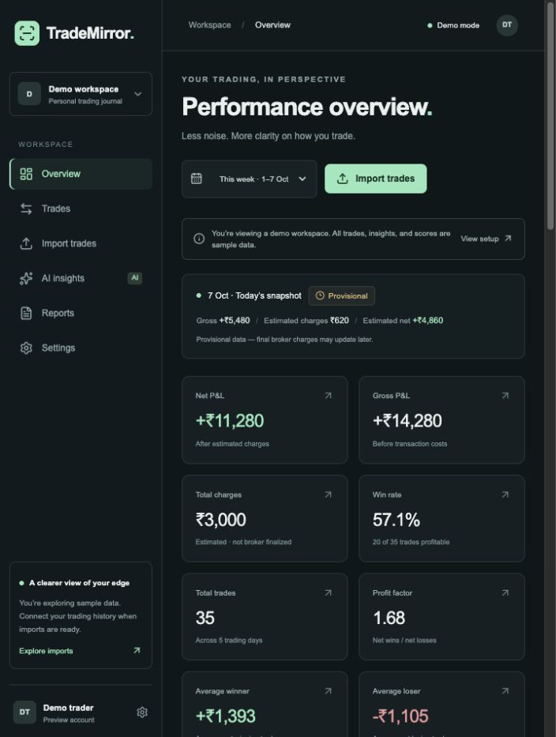

# TradeMirror

### Understand your trades. Improve your edge.

**A clearer view of your trading — from executions and costs to the patterns behind your decisions.**

TradeMirror is being built as a trading journal and performance analytics platform for Indian options traders. The goal is to bring trade history, charges-aware P&L, session comparisons, and AI-assisted behavioural reviews into one focused workspace.

> **Current status: Phase 2 connected · first account acceptance pending · version 0.2.0.**
> All dashboard numbers, reports, scores, and insights are sample data. Supabase account integration is connected and the database migration is applied. Imports, broker syncing, and AI generation remain planned.



## Live deployment

- **Website:** [trademirror-ten.vercel.app](https://trademirror-ten.vercel.app)
- **Dashboard:** [Open demo](https://trademirror-ten.vercel.app/dashboard)
- **Vercel project:** `trademirror` in `vkesirariwork-2297s-projects`
- **Git source:** this repository, `main` branch. Future pushes trigger Vercel deployments.
- **Mode:** authenticated workspace. Supabase is connected; signed-out workspace requests redirect to login. Account trade import remains planned.

First deployment completed on 7 October 2026 from commit `bfec0f9`; landing page and dashboard verified in the browser. Before activating authentication, set the public Supabase variables and `NEXT_PUBLIC_SITE_URL=https://trademirror-ten.vercel.app`, apply the database migration, and configure that origin in Supabase Auth.

## Product flow

### What works today

```text
Landing page → Explore demo → Dashboard
                              ├─ Search/filter trades → Trade detail → Demo notes
                              ├─ Import preview → Broker card / local CSV selection
                              ├─ Sample behaviour insights
                              ├─ Daily / weekly report previews
                              └─ Settings & report lifecycle explanation
```

With Supabase configured, signup/login use server actions, email confirmation establishes a session, and workspace routes require a validated user. Without configuration, forms show a setup notice and no credentials are sent to a provider. CSV selection stays local; preview rows remain fixed fixtures.

### Planned end-to-end experience

```text
Sign up / log in
      ↓
Upload Zerodha tradebook → Preview → Validate → Deduplicate → Import
      ↓
Normalize executions → Match trades → Calculate metrics in code
      ↓
Dashboard → Trade details & notes → Behaviour insights → Daily / weekly review
```

A later broker workflow will add:

```text
Connect broker → Sync executed trades → Provisional daily report
                                              ↓
                             Reconcile confirmed final broker data
                                              ↓
                                  Finalized report → Updated review
```

Charges remain estimated while a report is `PROVISIONAL`. A report becomes `FINAL` only when confirmed final broker data is available. Finalization will not depend on a hard-coded time such as 7:30 PM. Exact broker capabilities and data availability must be verified during integration.

## What is built

| Area | Current behaviour |
| --- | --- |
| Landing | Product introduction, workflow, demo and signup entry points |
| Dashboard | Eight summary cards; daily and cumulative P&L charts; session, instrument, CE/PE breakdowns; sample discipline score; best/worst and recent trades |
| Journal | Instrument search; instrument, CE/PE, result, session, and date filters; reset and empty states |
| Trade detail | Prices, quantities, timestamps, estimated costs, holding time, sample behaviour review, session-only notes |
| Imports | Broker connection preview; local CSV selection and illustrative preview table |
| Insights | Sample observations about timing, instruments, holding periods, costs, and journal process |
| Reports | Daily / weekly tabs; provisional status; summary and review prompts |
| Settings | Demo profile, broker connection card, provisional/final lifecycle |
| Foundation | Responsive navigation, loading UI, invalid-trade 404, normalized types, broker adapter contract |

The dashboard period selector changes summary cards between the sample day and week. Charts and breakdowns are explicitly labeled as the sample week. Fixtures cover 1–7 October 2026; they are not live market data.

## Version roadmap

The roadmap is a proposed sequence, not a release-date commitment. Later versions will be refined after the previous milestone is validated.

### V1 — A reliable trading journal

**Target:** upload a Zerodha CSV and review a trustworthy performance dashboard, with a target of approximately 30 seconds for a typical tradebook. This target is not yet measured.

| Phase | Scope | Status |
| --- | --- | --- |
| 1 | Frontend foundation, design, routes, sample data, normalized types | **Complete** |
| 2 | Supabase authentication, PostgreSQL schema, user isolation and access policies | **Connected; first account test pending** |
| 3 | Zerodha CSV parsing, validation, import history, duplicate protection | Planned |
| 4 | Deterministic trade matching, partial fills, open positions, reconciliation | Planned |
| 5 | P&L and cost analytics with explicit estimated / confirmed cost handling | Planned |
| 6 | Connect the dashboard and filters to actual user data | Planned |
| 7 | Persistent notes and trade detail metrics supported by available data | Planned |
| 8 | AI behaviour interpretation from computed, structured metrics | Planned |
| 9 | Daily / weekly review generation and report history | Planned |
| 10 | End-to-end validation, security checks, deployment and onboarding | Planned |

### V1.1 — Zerodha sync & final reports

- Verify supported broker APIs and authorization requirements, then implement the first adapter.
- Import executed trades and reconcile them with existing imports without duplicates.
- Support repeated synchronization, connection expiry, retries, and visible sync status.
- Refresh provisional reports when confirmed final data becomes available.
- Preserve report revisions so users can understand why net P&L changed.

Broker sync follows a reliable normalized import and matching engine. No real broker connection exists yet.

### V2 — A stronger review workflow

Proposed scope:

- Persistent trading plans and journal tags, with comparison against recorded rules.
- Evidence-based discipline scoring with transparent definitions and sufficient input data.
- Longer-term session, instrument, cost, and holding-time comparisons.
- Review history, PDF export, and user-controlled reminders.
- Additional broker adapters after verifying their supported data and integration requirements.

MFE, MAE, early-exit flags, and stop-loss violations will require suitable price or plan data. Missing inputs must remain unavailable rather than inferred from a tradebook alone.

### V3 — A mature performance workspace

Proposed direction, subject to user feedback:

- Unified history and reconciliation across supported brokers.
- Configurable review rules and personal progress tracking over time.
- Longitudinal coaching grounded in verified metrics and journal context.
- Reliable background synchronization, observability, and data-quality tooling.
- Production SaaS operations: billing, account export/deletion, recovery, and scale testing.

The product remains focused on trading reflection and analytics. Live signals, buy/sell recommendations, and automated order execution are outside the current roadmap.

## Development & delivery flow

Each phase follows the same loop:

1. Define the phase scope and acceptance criteria.
2. Implement the smallest complete milestone.
3. Run checks appropriate to the change; validate relevant UI and data behaviour.
4. Update this README with completed work, current limitations, validation results, and the next phase.
5. Commit the verified phase and push it to `main` in this repository.

Phase-by-phase pushes are authorized for this project. Each completion update should include the commit and any remaining blockers. Secrets, credentials, environment files, build outputs, and installed dependencies must not be committed. Publishing/deployment remains a separate action from a Git push.

## Progress log

| Milestone | Date | Result |
| --- | --- | --- |
| Phase 1: frontend foundation | 7 October 2026 | All requested demo routes built; lint, TypeScript, production build, route checks, journal filters, report tabs, and mobile navigation verified. Initial implementation commit: `be1d940`. |
| Documentation & roadmap | 7 October 2026 | Added current/planned product flows, V1–V3 roadmap, delivery workflow, limitations, and project description. |
| Phase 2: auth & database foundation | 7 October 2026 | Supabase integration, protected accounts, migration and access-policy tests implemented; hosted activation pending. |

**Current work:** Phase 2 is connected locally and on Vercel. The hosted migration is applied; all nine tables have RLS. Email/password signup and email confirmation are enabled. Signed-out redirects and anonymous table denial passed. First real-account email/session acceptance remains pending.

**Next implementation step:** Complete first-account hosted auth acceptance, then implement the validated Zerodha CSV pipeline (Phase 3).

## Run locally

Use **Node.js 20.19 or newer**; Node 24 is recommended and selected by `.nvmrc`.

```sh
# If using nvm:
nvm use

npm install
npm run dev
```

Open [localhost:3000](http://localhost:3000). For an existing lockfile, `npm ci` gives a reproducible install.

```sh
npm run lint
npm run typecheck
npm run build
npm start
```

`npm start` runs the production build; run `npm run build` first. The unconfigured sample demo requires no keys. For real authentication, follow [Supabase setup](supabase/README.md) and configure `.env.local` from `.env.example`. Never commit that file.

## Routes

| Route | Purpose |
| --- | --- |
| `/` | Landing page |
| `/login`, `/signup` | Signup/login with configured Supabase; setup notice otherwise |
| `/auth/confirm` | Confirmation token / PKCE callback with fixed local redirect |
| `/dashboard` | Performance overview |
| `/trades` | Searchable and filterable journal |
| `/trades/tm-1` | Example trade detail; sample IDs `tm-1` through `tm-8` |
| `/import` | Broker / CSV preview |
| `/insights` | Sample behaviour insights |
| `/reports` | Daily / weekly previews |
| `/settings` | Profile and broker connection preview |

## Stack & architecture

Current stack: Next.js 16.4 App Router, React, TypeScript, Tailwind CSS, Recharts, and Lucide. Implemented integration: Supabase Auth / PostgreSQL (connected). Planned service: an AI interpretation API.

| Location | Responsibility |
| --- | --- |
| `app/(workspace)/` | Shared demo layout and workspace routes |
| `components/` | Reusable UI, charts, journal, reports, and broker cards |
| `types/index.ts` | Normalized trades, orders, users, connections, metrics, insights, and report states |
| `data/mock.ts` | Sample fixtures, separate from components |
| `lib/analytics/` | Formatting today; deterministic matching and analytics in later phases |
| `lib/brokers/adapter.ts` | Future broker adapter contract |

Future implementations belong in `lib/brokers/adapters/`. Normalized trades must remain independent of broker payloads; `rawDataId` provides a reference for separately stored raw records. The initial migration and row-level policies are in `supabase/migrations/`. Setup and hosted acceptance checks are in `supabase/README.md`.

### Core rules

- Calculate metrics in deterministic code; let AI interpret structured results.
- Keep calculation engines outside UI components.
- Isolate data by authenticated user and enforce access at the database layer.
- Keep estimated charges visibly distinct from confirmed charges.
- Finalize reports using confirmed data availability, not a fixed clock time.
- Store unavailable metrics as unavailable; do not fabricate discipline or excursion signals.

## Current limitations

Supabase auth and profile persistence are configured locally and in production. No broker OAuth/API, CSV parsing, matching engine, production P&L or charges engine, AI generation, payments, notifications, cron jobs, or background workers.

Auth forms validate on the client and server. With project configuration, credentials go only to the configured Supabase Auth service through server actions. Files are not uploaded or parsed. Trade notes only remain in the mounted page session. Connect buttons explain future availability; AI generation and PDF export are disabled. Without Supabase configuration, workspace routes are public demo pages. With configuration, they require a valid session and display an empty account workspace; sample trades are never presented as account-owned records. Scores are illustrative rather than computed from rule adherence.

## Validation & dependency status

At Phase 1 completion:

- Lint, TypeScript, and production build passed.
- All main routes returned HTTP 200; unknown trade URLs returned HTTP 404.
- Journal filters, trade detail navigation, report tabs, and mobile navigation were checked in the browser.
- Production dependency audit reported zero vulnerabilities.
- The Next.js ESLint toolchain had a development-only `braces` advisory with five transitive audit entries. The offered automated fix was a lint-config downgrade; an upstream fix should be reviewed before changing the toolchain.

These are recorded validation results, not a continuous assurance. Re-run relevant checks as dependencies and implementations change.

## Phase 2 — Authentication & database foundation

Implemented:

- Official `@supabase/ssr` cookie client and Next.js Proxy session refresh.
- Signup, password login, email confirmation / PKCE callback, sign-out, and server-validated route protection.
- Configuration validation rejects partial configuration and privileged keys; no service-role client is shipped.
- A transactional migration for profiles, broker connections, imports, raw records, orders, trades, trade metrics, daily metrics, and AI reports.
- Row-level policies and column grants: users read their own records and can edit display names, notes, and planned risk fields; financial and broker records require a future trusted backend.
- Decimal financial storage, composite ownership foreign keys, uniqueness constraints, and signup profile creation/backfill.
- `npm test` executes migration and adversarial ownership checks in embedded PostgreSQL.
- Phase 2 lint, TypeScript, and production build passed. All configured workspace routes redirected signed-out requests to login; invalid confirmation returned login feedback; the unconfigured auth action displayed a setup notice.

**Hosted activation:** The migration was applied to the supplied Supabase project on 7 October 2026. All nine application tables have row-level security. Local configuration is in ignored `.env.local`; Vercel configuration is in environment settings. Production origin and exact localhost confirmation callbacks are allowed. Live/local signed-out dashboard redirects and anonymous REST denial were verified.

**Remaining acceptance:** The hosted database records one confirmed account, its profile, and a successful sign-in. Live authenticated navigation was verified after the hotfix; a fresh email/password submission and logout retest remain pending. The default Supabase email sender only delivers to organization members; custom SMTP is required for general public signup. Default confirmation templates remain in place, supported by the PKCE callback. See [Supabase email limits](https://supabase.com/changelog/29370-supabase-auth-changes-to-default-email-provider).

Authenticated accounts currently show an empty workspace. Real dashboards, trade loading, persistent trade notes, and import flows will be connected in subsequent phases. The unconfigured demo retains Phase 1 sample screens.

### Supabase connection milestone — 7 October 2026

Configured public project settings, applied the initial migration to an empty public schema, verified nine RLS-enabled tables, saved Vercel environment variables, and redeployed. Signup is enabled and email auto-confirmation remains disabled. Verified live login routing and anonymous denial without creating test accounts or sending emails. Public configuration values and credentials are not stored in Git.

### Authentication navigation fix — 7 October 2026

The workspace logo now returns to `/dashboard`. Signed-in visitors bypass login/signup, and the public homepage offers their workspace. Confirmation callbacks preserve an existing authenticated session; failed callbacks explain expired links or missing browser verification. Password login distinguishes invalid credentials, unconfirmed email, and rate limits. Confirmed users can sign in with their signup password even if the email link could not establish a browser session.

Validation: three tests, lint, TypeScript, and production build passed using Webpack. Local Turbopack could not bind its helper process port under the environment restrictions. Anonymous dashboard protection and confirmation fallback were checked. Production deployment of `75f746d` was Ready. In the user's authenticated browser, clicking the logo retained the dashboard; login/signup and the confirmation callback returned to the dashboard; the homepage showed workspace links. No password or confirmation email was accessed. A fresh password submission remains untested; if it still fails, the displayed error identifies the next investigation. Next: verify that flow, then connect real trade imports.

### Password recovery — 7 October 2026

Login now links to **Forgot password**. `/forgot-password` requests a Supabase reset email with account-neutral success feedback, rate-limit handling, and same-browser instructions. The existing approved `/auth/confirm` callback exchanges the recovery code before considering an existing session, then opens `/reset-password`. A short-lived HttpOnly browser marker selects the recovery destination; it does not grant authentication. Invalid links return to recovery with guidance. Password updates require a server-validated account session and matching 8–128 character passwords.

Validation: six tests passed, including mocked recovery requests, authenticated update checks, existing-session callback handling, and expired-code rejection. Lint, TypeScript, and Webpack production build passed. Reset email delivery and an actual password change must be completed by the account owner; no new password was entered or changed by the agent. Default Supabase email restrictions still apply. Next: owner recovery acceptance, then real trade imports.
